  
Updated: 11-6-17

# Lab 200 - Integration Cloud Service

## Introduction

This is the second of several labs that are part of the **ICS HCM Development Workshop**.

In this lab, you will learn how to create a basic ICS connection, using a basic orchestration.

## Objectives

- Create your first integration to echo an input to the output

## Required Artifacts

- The following lab and an Oracle Public Cloud account that will be supplied by your instructor.

## Login to your Oracle Cloud account

### Login to ICS Home Page

>***NOTE:*** the **User Name** and **Password** values will be given to you by your instructor. See _Lab 100 **1.1.1**: Login to your Oracle Cloud Account_ for more information on how to sign into the ICS home page

  

## Creating Simple Orchestration Integration

### Create a REST Connection

In this first part of the lab, we will create a connection :

Let’s start by logging into the Oracle Cloud account using your allocated user (demo.user1..10)  

>**NOTE:** All the screenshots use the _demo.user10_ account. Replace the _demo.user10_ with your assigned account to validate the steps illustrated in the screenshots.

---

**2.1** Click on the **Connection** section


**2.2** Click on **Create** in the upper right of the screen


**2.3** Select the **REST** Connection, by either doing a search, or by scrolling down to the **REST** connection, by clicking on the **Select** button of the **REST** connection.


**2.4** Fill in the information for the new connection

- **Name** in the form of _UserXX REST_ where XX is the number in your allocated user.
- **Role** _Trigger_ since we going to use the connection as a trigger to start the integration


**2.7** click **Create**


>***Note*** The default security configuration is set to **Basic Authentication**, which by the way, is the only option available for REST trigger connections. When invoking the trigger, we will use our ICS username/password.

**2.6** Click on **Test**


**2.7** Click **Save**


**2.8** Click on the **Close** link in the upper right

Your first connection appears in the list of configured connections and is even marked as **New** !


**2.9** Click on the **Oracle Integration Cloud** link in the upper left to get back to the Home page


### Creating an Integration!

**1.1** Click on the **Integrations** section on the ICS home page


**1.2** Click on the **Create** button in the upper right


**1.3** In the **Create Integration - Select a Style/Pattern** popup, select the **Orchestration**


**1.4** Fill in the form with the following information

- _What triggers this integration?_ **Application event or business object**
- _Name_ **UserXX Hello World**


**1.5** Click on **Create**


**1.6** In the **Triggers** panel, expand the **REST(nn)** heading, and find your connection, under **REST**

Drag and drop your connection **UserXX REST** in to the circle with plus sign, you will see the plus sign twirling when ready to drop


**1.7** Fill in the required values on **Basic Info** page, and click **Next >**

- **What do you want to call your endpoint?** _echo_
- **What is the endpoint's relative resource URI** _/echo_
- **What action does the endpoint perform?** _POST_
- **Configure a request payload for this endpoint** _Checked_
- **Configure for this endpoint to receive a response** _Checked_
- **Configure CORS (Cross Origin Resource Sharing)** _Checked_


**1.8** Select **JSON Sample**, select **JSON** in *type of payload* and click on **<<< inline >>>** to enter sample JSON


**1.9** Enter the following JSON into the **Enter Sample JSON**, click **Ok**, then **Next >**

```javascript
{
    "echo": "String to echo"
}
```


**1.10** Enable **CORS** for all domains, by entering **\*** in **Allowed Origins**


**1.11** Click on **Next >** to move on to the _Response_

**1.12** Select **JSON Sample**, select **JSON** in **type of payload** and click on **<<< inline >>>** to enter sample JSON


**1.13** Enter the following JSON into the **Enter Sample JSON**, then click **Ok**

```javascript
{
    "return": "String to echo"
}
```


**1.14** Back on the Response Page,  click **Next >** to get to the Summary page


**1.15** Click **Done**. The full flow will now be presented:


**1.16** Click on the **Map to echo** icon, and then on _pencil_ icon


The _Mapper_ page will appear


**1.17** Drag the **<\>echo** and drop on to **<\>return**

Alternatively, you can click on the circle just to the right of the **<\>echo** and drop it onto the circle just to the left of **<\>return**


**1.18** Click on **Validate**


**1.19** Click on **Close** in the upper right

You will notice that the **Map to echo** icon is filled in _all blue_ now indicating that it has been completely configured.


**1.20** Click on the _Hamburger_ icon in the upper right, then select **Tracking**


**1.21** Drag **\*echo** across to the right hand side, under **Tracking Field**


**1.22** Click on **Done**

**1.23** Click on **Save** and then **Close** to exit the integration design canvas


You should see your _New_ integration in list of _Integrations_


### Creating an FTP Connection

**1.1** Go to the cloud dashboard page and click on **Integration** service. Ex: https://myservices.us2.oraclecloud.com/mycloud/faces/dashboard.jspx

Every domain will have FTP server associated with it. We will use this FTP server to host our files.


**1.2** Check the Additional Information. The FTP server details are given.

Copy Domain SFTP User Name, Host, port, and save it somewhere.

**Domain SFTP User Name:**
**SFTP Host:**
**Port:**


This will be the FTP user which is used in FTP connection creation.


**1.3** You can also access this info by clicking  on **Users** on the top right  ->SFTP Users  Username


**1.4** Now click on the SFTP Users in the panel to see the users with Secure FTP user accounts.


**1.5** Navigate back to the ICS console


Now click on the **Connections**


**1.6** On the top bar click on **Create** to bring up the menu to create a new Connection.


The following prompt should pop up. Either scroll down and select or search for "FTP"


**1.7** The following screen should display when you click to create a new FTP Connection.

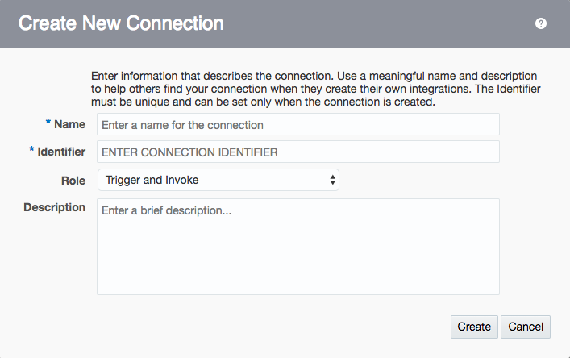

**1.8** In the **Name** field enter "ICSHCM-POC-FTP_UserXX" and replace the "XX" with your assigned user name.

Set the Role to **Trigger and Invoke**


**1.9** Click on **Configure Connectivity**. Use the
Domain **SFTP Host** as **FTP server host address** from step **1.2** which was retrieved from dashboard, without the port included.

Enter the **Port** as found in step **1.2**. It is most likely **22**.

Set the **SFTP Connection** to **True**.

Port : 22
SFTP connection: True

Then click **Ok** to close.


**1.10** Scroll down the same page and then click on the **Configure Security**. This will bring up the prompt to configure your FTP Security.


**1.11** You will now be asked to create the Security credentials for your FTP connection.

Leave the **Security Policy** as **FTP Server Access Policy**, or else change it if something else is selected.

For the **User Name** use the **Domain SFTP User Name** that you previously saved from step **1.2**.

In the **Password** field user the password that you originally used to log into Oracle Cloud. It will be the password for either the cloud.admin or UserXX users.

Now click on **Ok** to close the prompt.


**1.12** Then click **Test** in order to test the connect. A green bar should come across the top of the screen that reads, "Connection ICSHCM-POC-FTP_UserXX was tested successfully."


Click on the **Save** in order to save your Connection. A green bar should come across the top of the screen that reads, "Connection ICSHCM-POC-FTP_UserXX was saved successfully."


----

### ICS and HCM Connections

**1.1** From the Integration Cloud Dashboard, click on the "Connections".
ICS console will be loaded in new window.

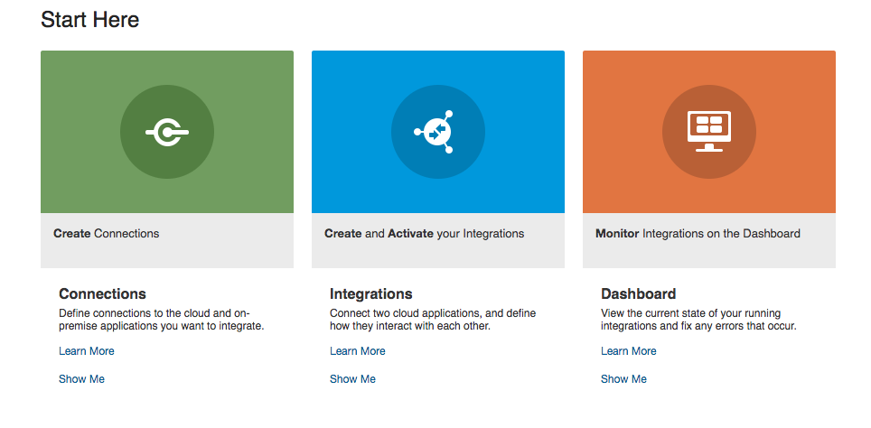

**1.2** In the search bar, search for "ICSHCM". You should see green checks if they are all configured correctly.


If you see anything other than green checks, then go back to the previous steps and set up the connections.


**1.3** Now go back to the dashboard and go to the "Integrations". Click on “ICSHCM_Add Talent Profile” or search if it is not in view on the screen.


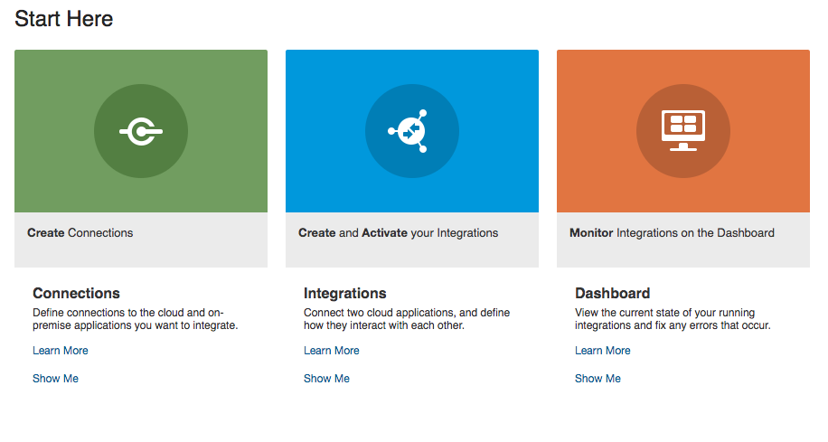

If the integration is not activated then you will need to click on the slider to activate the integration. Do not enable tracing or include payload.


Since the integration is already created and imported we won’t be recreating integration. Let’s review the various steps in the ICS – HCM data load integration
Please see the below image for the entire integration flow. The orchestration flow generally matches the logic flow described earlier. Details of each node are discussed in sequence in the following section.

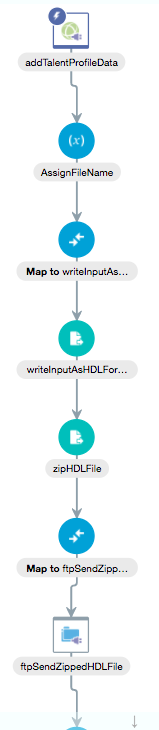


**1.4** Click on “addTalentProfileData”. Do not edit anything, just review.


This is the start node of the integration is based on the SOAP_TalentProfile_Input connection (trigger). After the wizard completes, the summary page should look like the following:

Click on the eye to open up the prompt screen.

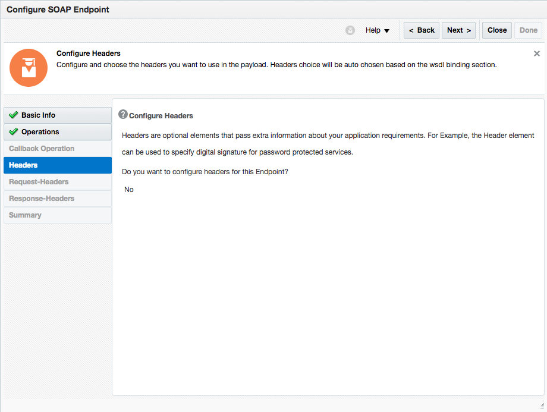


Now close the prompt.

**1.5** Click on “AssignFileName” and click on the eye again to open up the prompt.

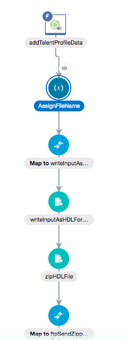


There are two file names involved in HCM Data Loader.
First, the zip file name can be any name with a zip extension.
Second file name is the actual data file contained in the zip file. HCM Data Loader defines a file name for each data object. In our case, the data file name must be TalentProfile.dat.
In our implementation, the zip file name has a pattern of “TPyyyymmddhhmmss”. The zip extension is appended in a later step.

Now click the close in order to go back to the map screen.


**1.6** Click on the “Map to writeInputAsHDLFormat” and click on the eye again to open up the prompt.

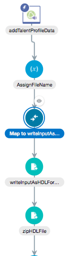

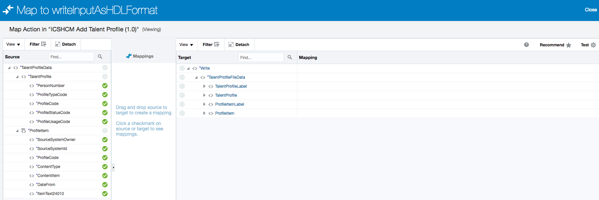

This third step maps an input XML data to a full XML data set that contains additional meta data labels required by HDL.Below is a picture of the mapper UI.

Now click the close in order to go back to the map screen.

**1.7** Click on the “writeInputAsHDLFormat” and click on the eye again to open up the prompt.


The fourth step uses an early adopter feature called Stage File.
The Stage File activity allows read, write and zip operations to files local to ICS instance. When reading and writing files, Stage File allows translation of file content between XML and native format via a native schema file (.nxsd). For common native formats such CSV (Comma Separated Values), Stage File supplies a mapping tool for drag and drop mapping.
At this step of integration, Stage File is used to write the full XML data set with labels from step 3 to a temporary file with a translation defined by hcm-talentprofile.nxsd. The resulting HDL Format data file looks like TalentProfile.dat. Notice that the file name is fixed to TalentProfile.dat as required by HCM Data Loader.


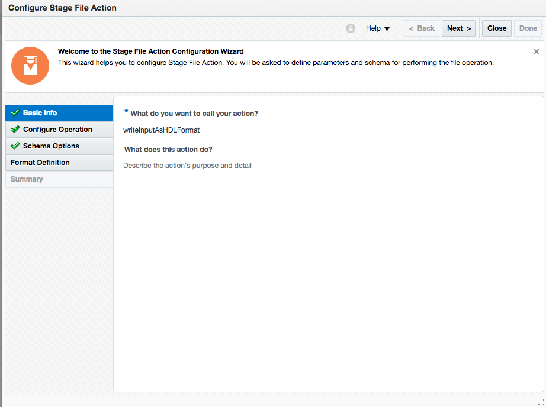

Click on "Next" to move to move to the next screen.


Click on "Next" to move to move to the next screen.

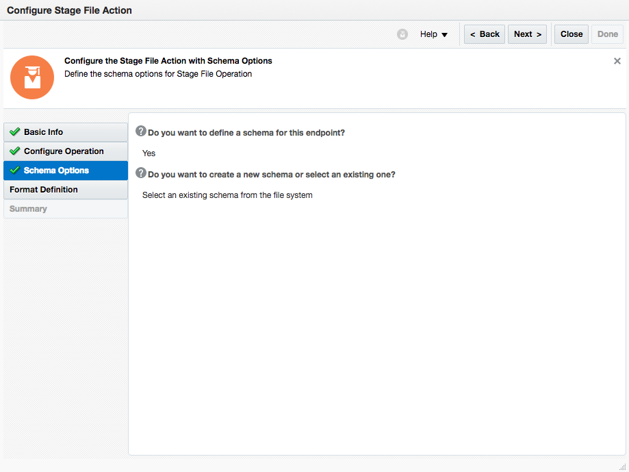

Click on "Next" to move to move to the next screen.


Click on "Next" to move to move to the next screen.


Now click the close in order to go back to the map screen.

**1.8** Click on the “zipHDLFile” and click on the eye again to open up the prompt.

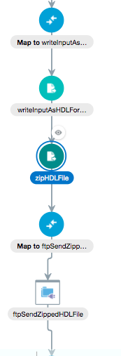

Now click through the "Next" to move through the prompt screens and then finally "close" to close the screen.


Bottom Page 34

**1.9** Click on the “map to ftpSendZippedHDLFile” and click on the eye again to open up the prompt.

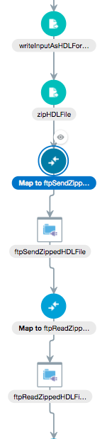

Now click through the "Next" to move through the prompt screens and then finally "close" to close the screen.


**1.10** Click on the “ftpSendZippedHDLFile” and click on the eye again to open up the prompt.

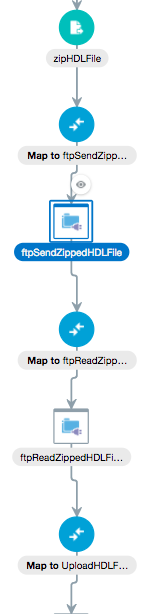

Step 7 sends the zipped HDL file from ICS local drive to the FTP server. Notice the File Name Pattern is set. But in our implementation, this default file name pattern is overridden by the file name in the input XML data set in the Step 6.


Now click through the "Next" to move through the prompt screens and then finally "close" to close the screen.

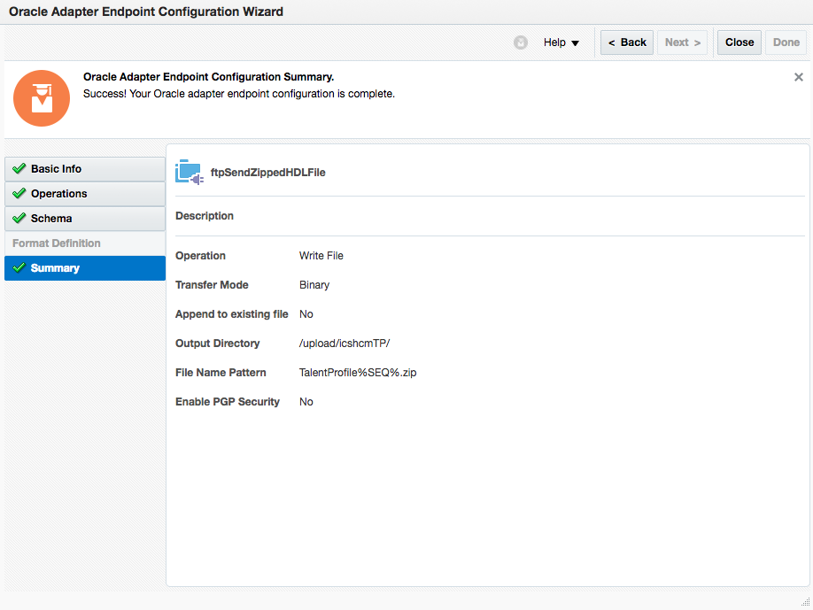

**1.11** Click on the “ftpSendZippedHDLFile” and click on the eye again to open up the prompt.

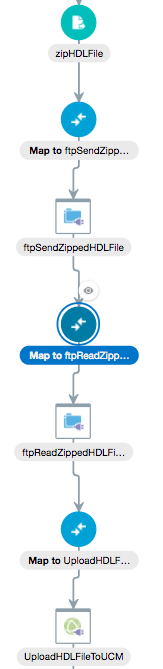

Step 8 maps the file name and directory from the output of Step 7 to the input of Step 9. The mapping should look like the following:


Now click through the "Next" to move through the prompt screens and then finally "close" to close the screen.

----


### Activating Integration

**1.1** Click on the switch next to your integration to activate


**1.2** On the **Activate Integration ?** popup window, select **Enable Tracing**, then **Include payload**, then click on **Activate**


**1.3** Capture the link displayed after activation


If you need the URL again, you can always get back to it by clicking on the **i** icon of your active integration


----

## Testing Integration

Testing the activated integration can be done using multiple tools and depends on your preference. See each relevant product's website on how to install the tool, if required.

----

### **SOAPUI**

----

**1.1** Open SOAPUI


**1.2** Right click on **Projects** and select **Create Empty Project**


**1.3** Right click on the new **Project1** and select **Import Swagger**


**1.4** Fill in the **Swagger Definition:** using the URL we have captured in **Activating Integration**, step **1.3**. Append ***/swagger***
Click on **OK** to import Swagger from ICS


**1.5** When asked for credentials, enter your ICS user credentials


**1.6** Expand **Project 1** to show the **Request 1**. Double Click the **Request 1** to open the Request Window


**1.6** Click on the Auth tab on the left hand bottom of the **Request 1** Window and select **Add New Authorization**


**1.7** Select **Basic** in the popup window


**1.8** Fill your username and password


**1.9** Fill in the request body with following JSON:

```javascript
{ "echo": "Hello World!" }
```


**1.10** Click on the green **Run** triangle at top **Request 1** Window

**1.11** Last step is to switch to JSON Format in the output panel


And you should be able to see an **echo** of your input in the output panel


----

### **POSTMAN**

----

**1.1** Got to URL **chrome:/apps** in _Chrome_ and open POSTMAN


**1.2** Click on the **Import** on the main title bar


**1.3** Back in a browser window, open the URL we have captured in **Activating Integration**, step **1.3**. Append ***/swagger*** - supply your username and password if asked gor it.


**1.4** Copy the Swagger text displayed in the browser window, it should look similar to the following.

```javascript
{
  "swagger" : "2.0",
  "info" : {
    "description" : "Description of the service [Title is not available at Runtime unless we store it in JCA. Need to check for Description]",
    "version" : "1.0",
    "title" : "Title of the Service [Reference Binding Name]"
  },
  "host" : "ttcics-gse00003021.integration.us2.oraclecloud.com:443",
  "basePath" : "/integration/flowapi/rest/USERXX_HELLO_WORLD/v01",
  "schemes" : [ "https" ],
  "paths" : {
    "/echo" : {
      "post" : {
        "consumes" : [ "application/json" ],
        "produces" : [ "application/json" ],
        "parameters" : [ {
          "in" : "body",
          "name" : "request-wrapper",
          "required" : false,
          "schema" : {
            "$ref" : "#/definitions/echo"
          }
        } ],
        "responses" : {
          "default" : {
            "description" : "A sample description of the Response",
            "schema" : {
              "$ref" : "#/definitions/return"
            }
          }
        }
      }
    }
  },
  "definitions" : {
    "echo" : {
      "type" : "string"
    },
    "return" : {
      "type" : "string"
    }
  }
}
```

**1.5** Back in POSTMAN, select **Paste Raw Text**, and paste the text into the text box


**1.6** Click on **Import** to import in POSTMAN


**1.7** Click on the **Authorization** tab


**1.8** Change the Authorization settings as follow:

- **Type**     _Basic Auth_

- **Username** _demo.userXX_

- **Password** _YOURPASSWORD FOR ICS_


**1.9** Click **Update Request**

**1.10** Click on the **Body** tab, make sure **raw** and **JSON(application/json)** is selected. Enter the following text in to the body text box

````javascript
{
    "echo":"Hello World!"
}
````


**1.11** Click on the blue **Send**. Look at the bottom to see the output, the Body should contain the following value, and the Status should indicate a **200 OK**

````javascript
{
    "return":"Hello World!"
}
````


----

### **Swagger Editor**

----

**1.1** Back in a browser window, open the URL we have captured in **Activating Integration**, step **1.3**. Append ***/swagger*** - supply your username and password if asked for it.


**1.2** Copy the Swagger text displayed in the browser window, it should look similar to the following.

```javascript
{
  "swagger" : "2.0",
  "info" : {
    "description" : "Description of the service [Title is not available at Runtime unless we store it in JCA. Need to check for Description]",
    "version" : "1.0",
    "title" : "Title of the Service [Reference Binding Name]"
  },
  "host" : "ttcics-gse00003021.integration.us2.oraclecloud.com:443",
  "basePath" : "/integration/flowapi/rest/USERXX_HELLO_WORLD/v01",
  "schemes" : [ "https" ],
  "paths" : {
    "/echo" : {
      "post" : {
        "consumes" : [ "application/json" ],
        "produces" : [ "application/json" ],
        "parameters" : [ {
          "in" : "body",
          "name" : "request-wrapper",
          "required" : false,
          "schema" : {
            "$ref" : "#/definitions/echo"
          }
        } ],
        "responses" : {
          "default" : {
            "description" : "A sample description of the Response",
            "schema" : {
              "$ref" : "#/definitions/return"
            }
          }
        }
      }
    }
  },
  "definitions" : {
    "echo" : {
      "type" : "string"
    },
    "return" : {
      "type" : "string"
    }
  }
}
```

**1.3** Open http://editor.swagger.io

**1.4** Open File -> Paste JSON...


**1.5** Paste the Swagger JSON in the text box, and click on **Import**


**1.6** In the editor you will see Swagger YAML. Change this text to add the security definition


- Change the code to the following, changes __marked <--__

```
swagger: '2.0'
info:
  description: >-
    Description of the service [Title is not available at Runtime unless we
    store it in JCA. Need to check for Description]
  version: '1.0'
  title: 'Title of the Service [Reference Binding Name]'
host: 'ttcics-gse00003021.integration.us2.oraclecloud.com:443'
basePath: /integration/flowapi/rest/USER10_HELLO_WORLD/v01
schemes:
  - https
```
<-- Insert the following
```
securityDefinitions:
  basicAuth:
    type: basic
    description: HTTP Basic Authentication.
```
<-- Up to here
```
paths:
  /echo:
    post:
```
<-- Insert the following
```
      security:
       - basicAuth: []
```
<-- Up to here
```
      consumes:
        - application/json
      produces:
        - application/json
      parameters:
        - in: body
          name: request-wrapper
          required: true
          schema:
            $ref: '#/definitions/echo'
      responses:
        default:
          description: A sample description of the Response
          schema:
            $ref: '#/definitions/return'
definitions:
  echo:
    type: string
  return:
    type: string

```

**1.7** Next we have change the input/out parameters

In the parameters and reponses, we have to change the definitions:

```` javascript

parameters:
        - in: body
          name: body
          description: Updated user object
          required: true
          schema:
            $ref: '#/definitions/echoBody'
      responses:
        '200':
          description: successful operation
          schema:
            $ref: '#/definitions/return'
        default:
          description: Error occured

````

And then define the schemas under definitions

```` javascript
definitions:
  echoBody:
    type: object
    properties:
      echo:
          type: string
  return:
    type: object
    properties:
      return:
        type: string
````

The result should be similar to the following

```` javascript
swagger: '2.0'
info:
  description: >-
    Description of the service [Title is not available at Runtime unless we
    store it in JCA. Need to check for Description]
  version: '1.0'
  title: 'Title of the Service [Reference Binding Name]'
host: 'ttcics-gse00003021.integration.us2.oraclecloud.com:443'
basePath: /integration/flowapi/rest/USER10_HELLO_WORLD/v01
schemes:
  - https
securityDefinitions:
  basicAuth:
    type: basic
    description: HTTP Basic Authentication.
paths:
  /echo:
    post:
      security:
       - basicAuth: []
      operationId: HelloWorld
      consumes:
        - application/json
      produces:
        - application/json
      parameters:
        - in: body
          name: body
          description: Updated user object
          required: true
          schema:
            $ref: '#/definitions/echoBody'
      responses:
        '200':
          description: successful operation
          schema:
            $ref: '#/definitions/return'
        default:
          description: Error occured
definitions:
  echoBody:
    type: object
    properties:
      echo:
          type: string
  return:
    type: object
    properties:
      return:
        type: string
````

**1.8** Do the authentication call


**1.9** Fill in your username and password for ICS, and click **Authenticate**


**1.10** Click **Try this operation**


**1.11** Fill in our **echo** value. Notice the change in the body underneath, click on **Send Request**


**1.12** Result


----


- This Lab is now completed.
