  
Updated: 11-6-17

# Lab 200 - Creating ICS Connections

## Introduction

This is the second of several labs that are part of the **ICS HCM Development Workshop**.

In this lab, you will learn how to create a basic ICS connection, using a basic orchestration.

## Objectives

- Create your first integration to echo an input to the output

## Required Artifacts

- The following lab and an Oracle Public Cloud account that will be supplied by your instructor.

## Login to your Oracle Cloud account

### Login to ICS Home Page

>***NOTE:*** the **User Name** and **Password** values will be given to you by your instructor. See _Lab 100 **1.1.1**: Login to your Oracle Cloud Account_ for more information on how to sign into the ICS home page

  

## Creating Simple Orchestration Integration

### Create Talent Profile SOAP Input Connection

This connection is used to call the importAndLoadData operation of the HCM Data Loader SOAP API. Its WSDL URL points to an HCM Cloud instance in Oracle’s demo environment.

**1.1** Click on the **Connections** section

**1.2** Click on **Create** in the upper right of the screen

**1.3** Select the **SOAP** Connection, by either doing a search, or by scrolling down to the **SOAP** connection, by clicking on the **Select** button of the **SOAP** connection.

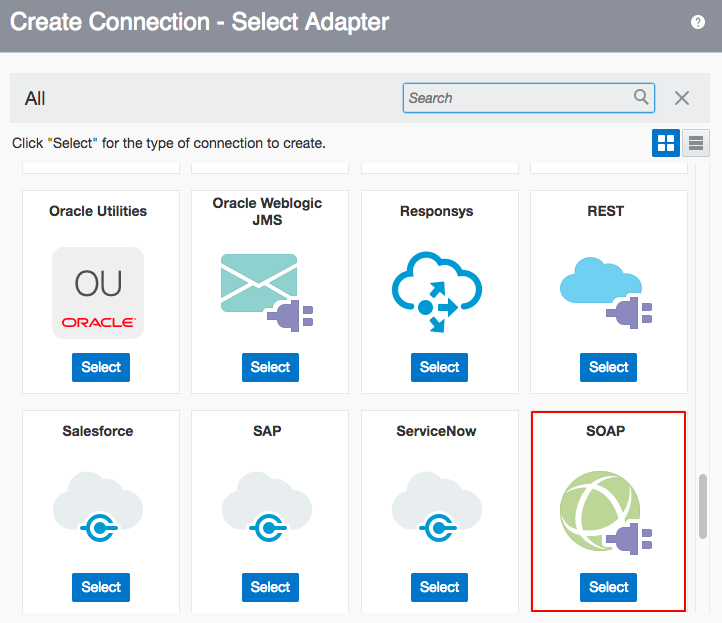

**1.4** Fill in the information for the new connection

- **Name** in the form of _ICSHCM_SOAP_TalentProfile_Input_UserXX_ where XX is the number in your allocated user.
- **Role** _Trigger_ since we going to use the connection as an trigger the start of an integration

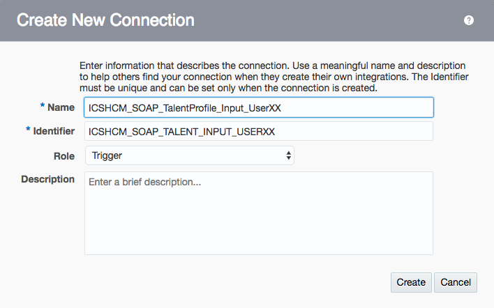

**1.5** click **Create**

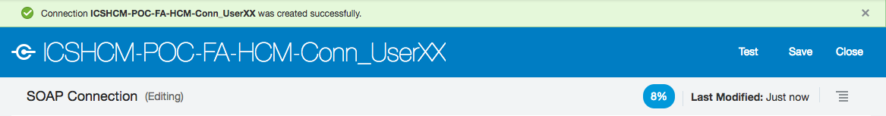

**1.6** Click on the connection you just created. It opens up the window for you to configure different properties for the adapter.

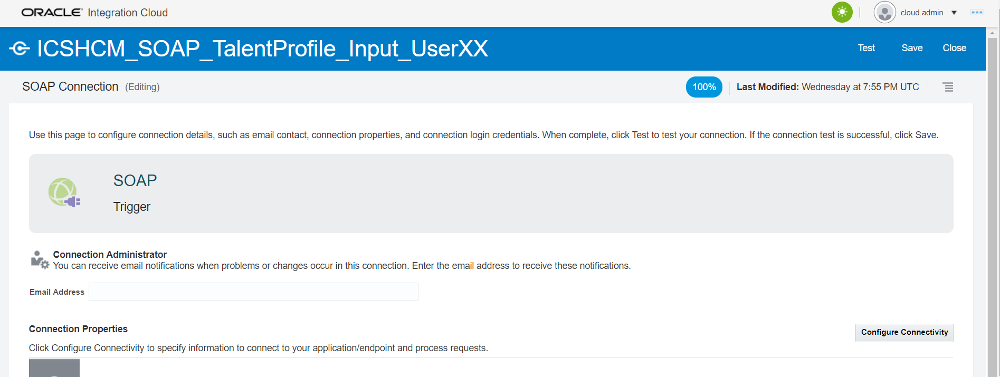

We need to access the file "TalentProfile.wsdl" for our next step. The file is located in the Artifacts folder given as part of the workshop by the instructor. Please make sure you have the file before moving on to next step.

**1.7** Click on **Configure Connectivity** under **Connection Properties** section.
Check the box under the **Upload File** column.
Then click on the **Upload Button**

Open up the folder Artifacts that was provided to you and locate the file "TalentProfile.wsdl".
Select this file and click **OK**.

Then click **Ok** to close.

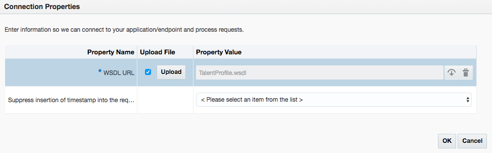

**1.8** Scroll down the same page and then click on the **Configure Security** under the **Security** section. This will bring up the prompt to configure your SOAP Security.

**1.9** You will now be asked to create the Security credentials for your SOAP connection.

Leave the **Security Policy** as **Username Password Token**, or else change it if something else is selected.

This is what is required to login to Integration Cloud Service

Now click on **Ok** to close the prompt.

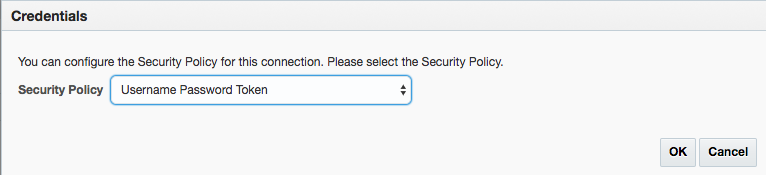

**1.10** Click on **Test**

**1.11** Click **Save**

**1.12** Click on the **Close** link in the upper right

Your connection appears in the list of configured connections and is even marked as **New** !

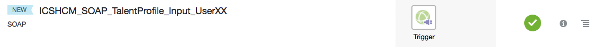

----

### Create the FA-UCM SOAP Connection

This connection is used to call the importAndLoadData operation of the HCM Data Loader SOAP API. Its WSDL URL points to an HCM Cloud instance in Oracle’s demo environment.

**2.1** Click on the **Connection** section

**2.2** Click on **Create** in the upper right of the screen

**2.3** Select the **SOAP** Connection, by either doing a search, or by scrolling down to the **SOAP** connection, by clicking on the **Select** button of the **SOAP** connection.

**2.4** Fill in the information for the new connection

- **Name** in the form of _ICSHCM-POC-FA-UCM-Conn_UserXX_ where XX is the number in your allocated user.
- **Role** _Invoke_ since we going to use the connection as an invoke to start the integration

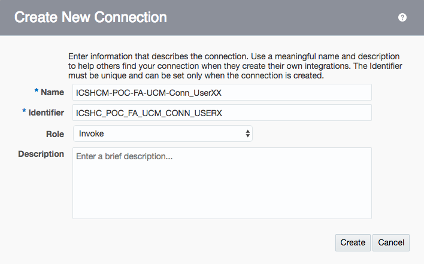

**2.7** click **Create**

**2.8** Click on **Configure Connectivity**.

In the **WSDL URL** field enter "https://ucf6-fap0868-fs.oracledemos.com/idcws/GenericSoapPort?WSDL"

Then click **Ok** to close.

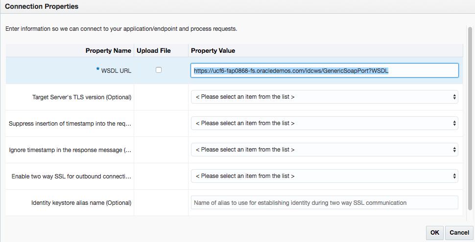

>***Note*** The default security configuration is set to **Basic Authentication**, which by the way, is the only option available for REST trigger connections. When invoking the trigger, we will use our ICS username/password.

**2.9** Scroll down the same page and then click on the **Configure Security**. This will bring up the prompt to configure your SOAP Security.

**2.10** You will now be asked to create the Security credentials for your SOAP connection.

Leave the **Security Policy** as **Basic Authentication**, or else change it if something else is selected.

We need configure **User Name** and **Password**. The **User Name** and **Password** can be obtained from the supplement guide provided by the instructor. 

Now click on **Ok** to close the prompt.

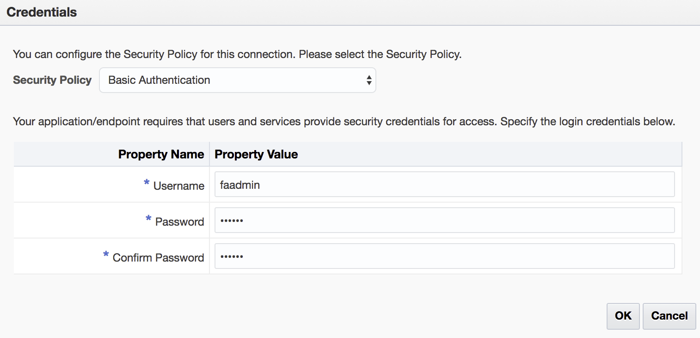

**2.11** Click on **Test**

**2.12** Click **Save**

**2.13** Click on the **Close** link in the upper right

Your connection appears in the list of configured connections and is even marked as **New** !

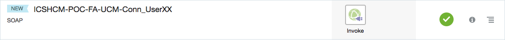

----

### Create the FA-HCM SOAP Connection

This connection is used to call the GenericSoapPort service of UCM to upload the data file to UCM. Basic authentication must be configured. The WSDL URL points to the UCM instance associated with the HCM instance.

**1.1** Click on the **Connection** section

**2.2** Click on **Create** in the upper right of the screen

**2.3** Select the **SOAP** Connection, by either doing a search, or by scrolling down to the **SOAP** connection, by clicking on the **Select** button of the **SOAP** connection.

**2.4** Fill in the information for the new connection

- **Name** in the form of _ICSHCM-POC-FA-HCM-Conn_UserXX_ where XX is the number in your allocated user.
- **Role** _Invoke_ since we going to use the connection as an invoke to start the integration

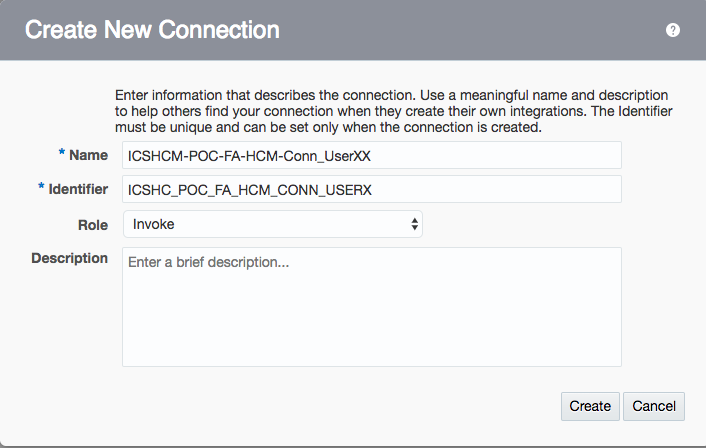

**2.7** click **Create**

**2.8** Click on **Configure Connectivity**.
In the **WSDL URL** field enter "https://ucf6-fap0868-hcm.oracledemos.com/hcmCommonDataLoader/HCMDataLoader?WSDL"

Then click **Ok** to close.

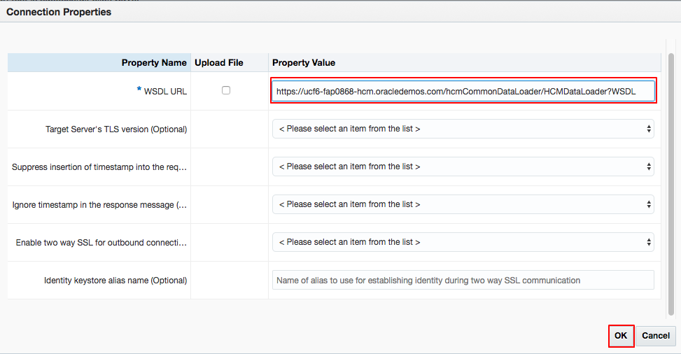

>***Note*** The default security configuration is set to **Basic Authentication**, which by the way, is the only option available for REST trigger connections. When invoking the trigger, we will use our ICS username/password.

**2.9** Scroll down the same page and then click on the **Configure Security**. This will bring up the prompt to configure your SOAP Security.

**2.10** In another tab, go to demo environment launch pad, click on the **Get SaaS Passwords** to get latest username and passwords for UCM cloud. Write these down to use in the next step.

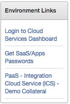

**2.11** You will now be asked to create the Security credentials for your FTP connection.

Leave the **Security Policy** as **Basic Authentication**, or else change it if something else is selected.

For the **User Name** use the **User name** that you previously saved from step **2.10**.

In the **Password** field use the password that you found in step **2.10**

Now click on **Ok** to close the prompt.

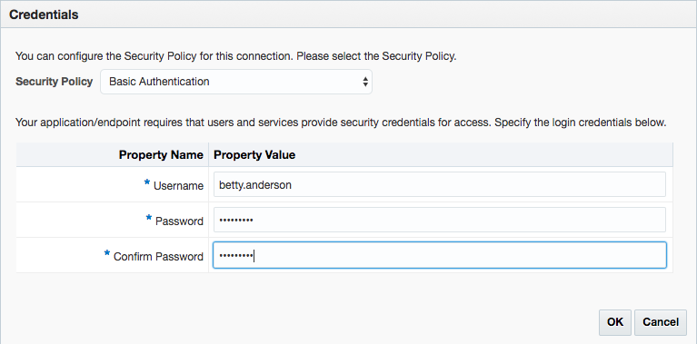

**2.12** Click on **Test**

**2.13** Click **Save**

**2.14** Click on the **Close** link in the upper right

Your first connection appears in the list of configured connections and is even marked as **New** !

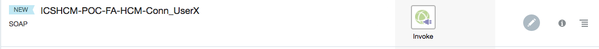

----

### Creating an FTP Connection

**1.1** Go to the cloud dashboard page and click on **Integration** service. Ex: https://myservices.us2.oraclecloud.com/mycloud/faces/dashboard.jspx

Every domain will have FTP server associated with it. We will use this FTP server to host our files.

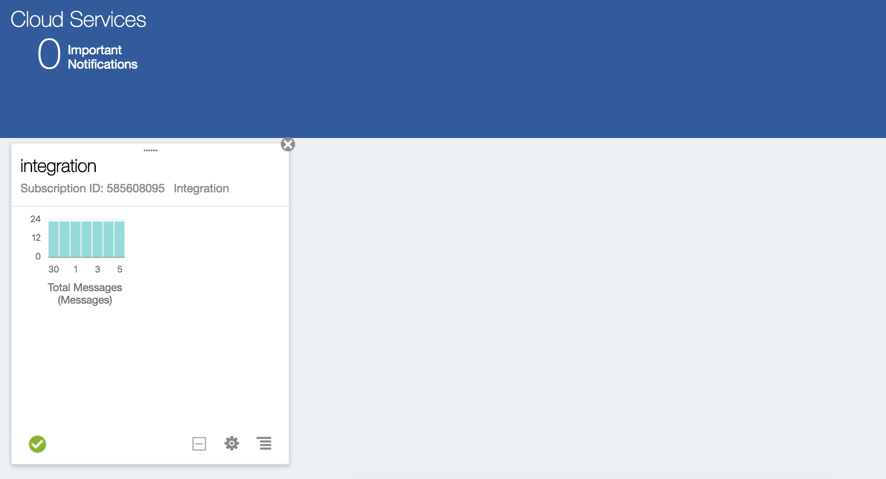

**1.2** Check the Additional Information. The FTP server details are given.

Copy Domain SFTP User Name, Host, port, and save it somewhere.

**Domain SFTP User Name:**
**SFTP Host:**
**Port:**

This will be the FTP user which is used in FTP connection creation.

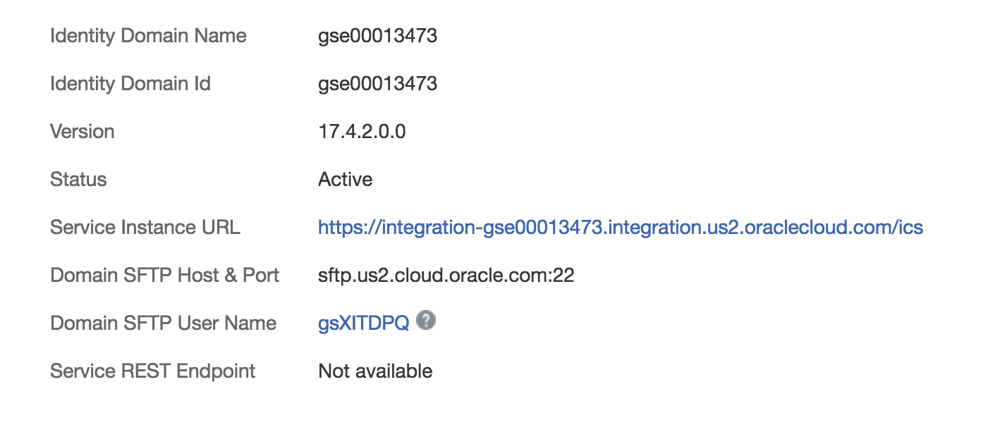

**1.3** You can also access this info by clicking  on **Users** on the top right  ->SFTP Users  Username

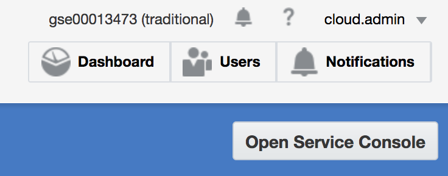

**1.4** Now click on the SFTP Users in the panel to see the users with Secure FTP user accounts.

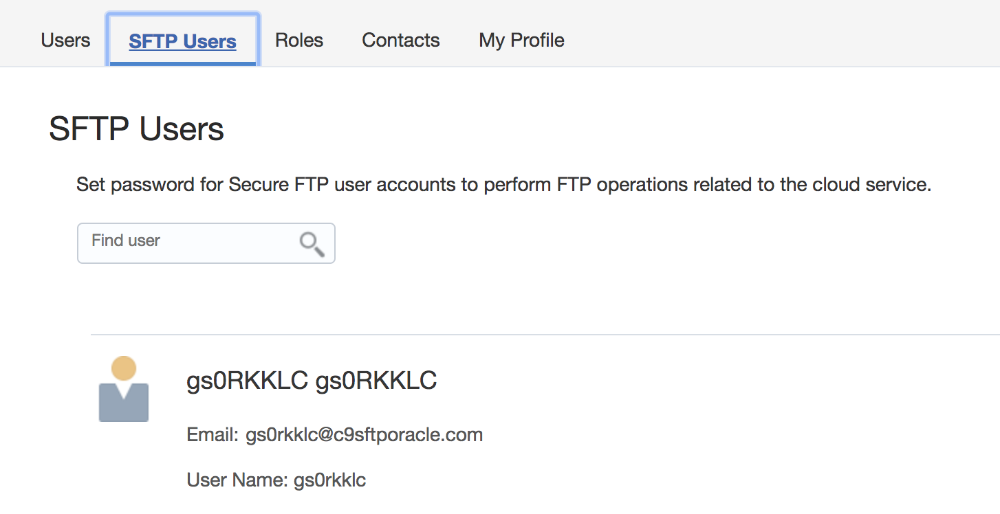

**1.5** Navigate back to the ICS console

Now click on the **Connections**

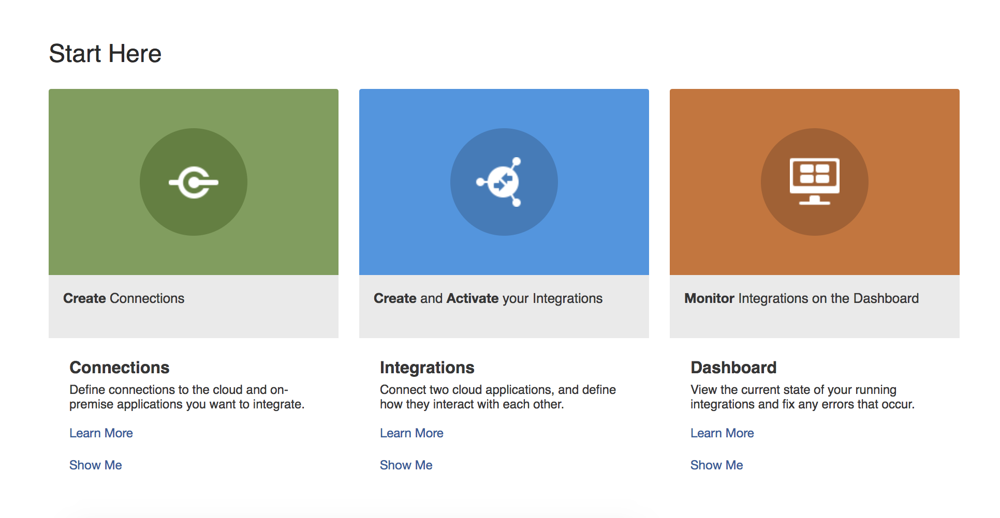

**1.6** On the top bar click on **Create** to bring up the menu to create a new Connection.

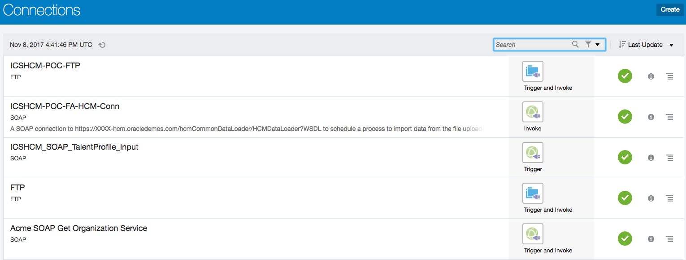

The following prompt should pop up. Either scroll down and select or search for "FTP"

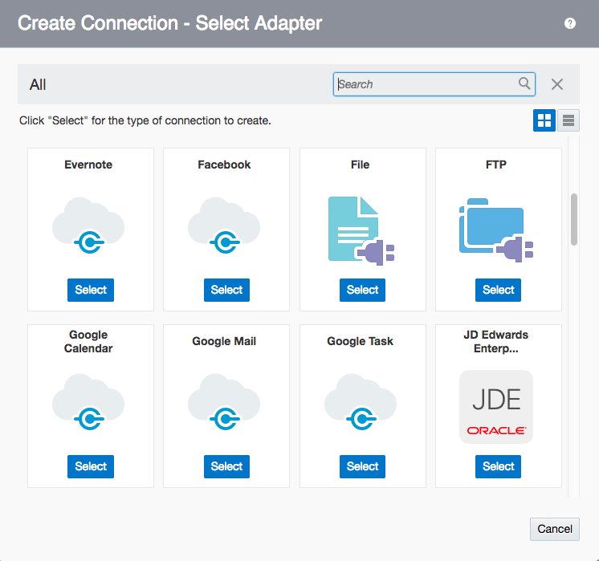

**1.7** The following screen should display when you click to create a new FTP Connection.

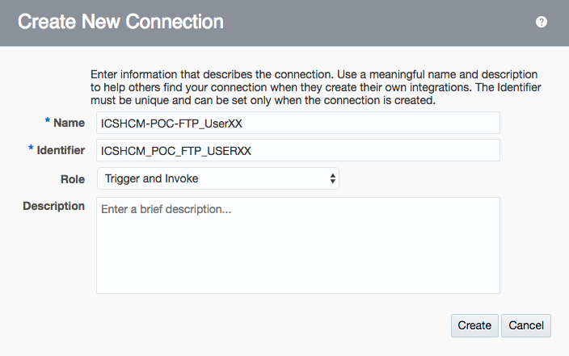

**1.8** In the **Name** field enter "ICSHCM-POC-FTP_UserXX" and replace the "XX" with your assigned user name.

Set the Role to **Trigger and Invoke**

**1.9** Click on **Configure Connectivity**. Use the
Domain **SFTP Host** as **FTP server host address** from step **1.2** which was retrieved from dashboard, without the port included.

Enter the **Port** as found in step **1.2**. It is most likely **22**.

Set the **SFTP Connection** to **True**.

Port : 22
SFTP connection: True

Then click **Ok** to close.

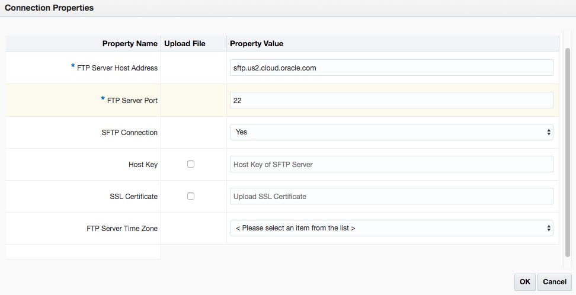

**1.10** Scroll down the same page and then click on the **Configure Security**. This will bring up the prompt to configure your FTP Security.

**1.11** You will now be asked to create the Security credentials for your FTP connection.

Leave the **Security Policy** as **FTP Server Access Policy**, or else change it if something else is selected.

For the **User Name** use the **Domain SFTP User Name** that you previously saved from step **1.2**.

In the **Password** field user the password that you originally used to log into Oracle Cloud. It will be the password for either the cloud.admin or UserXX users.

Now click on **Ok** to close the prompt.

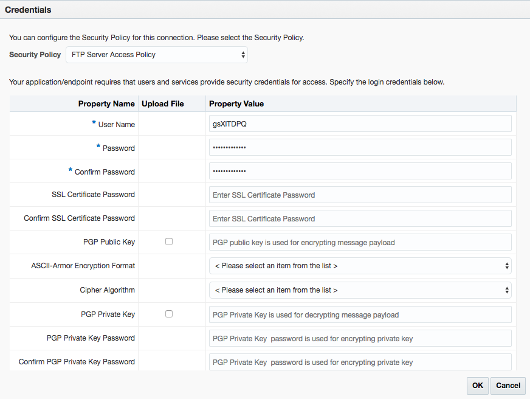

**1.12** Then click **Test** in order to test the connect. A green bar should come across the top of the screen that reads, "Connection ICSHCM-POC-FTP_UserXX was tested successfully."

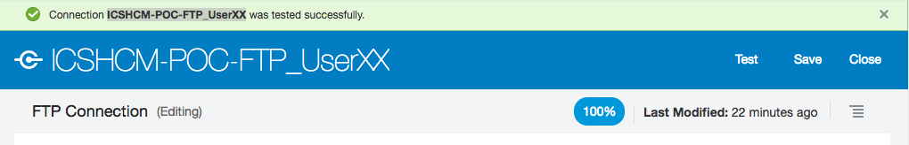

Click on the **Save** in order to save your Connection. A green bar should come across the top of the screen that reads, "Connection ICSHCM-POC-FTP_UserXX was saved successfully."

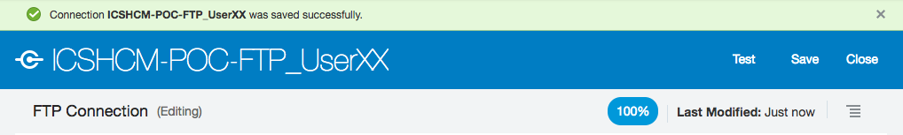

----

- This Lab is now completed.
