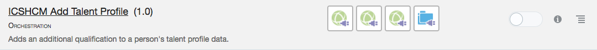
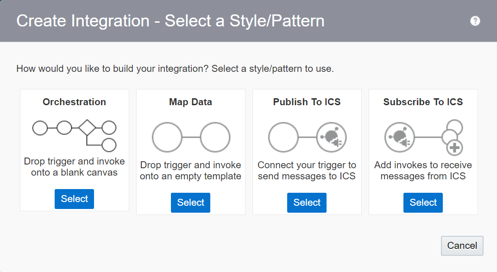
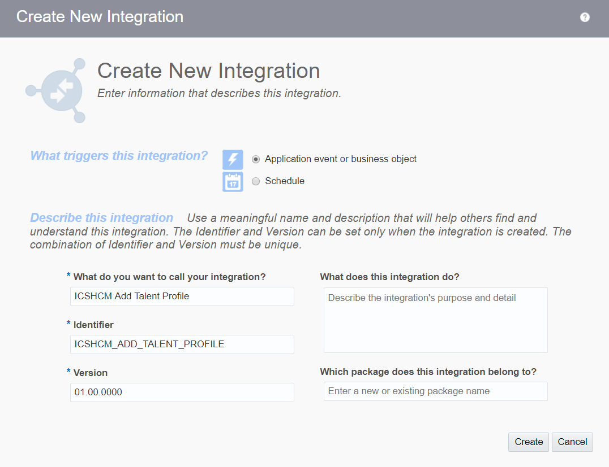
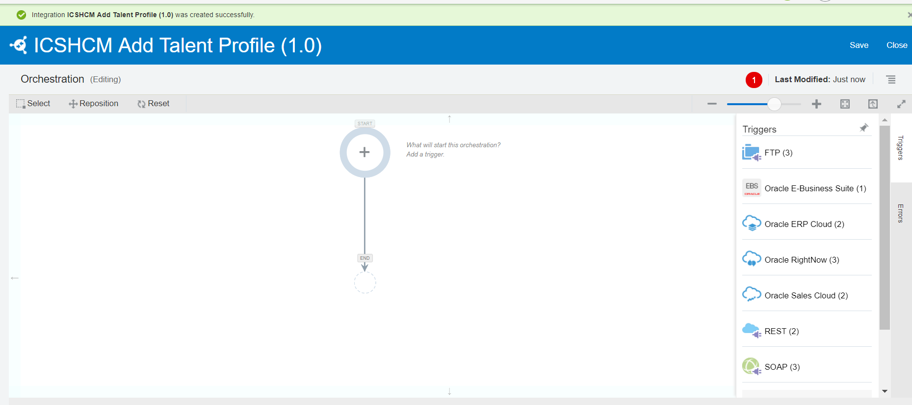
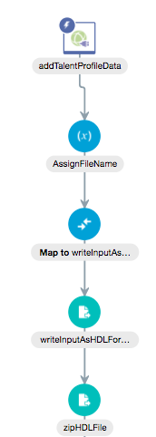
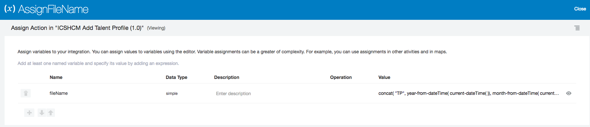
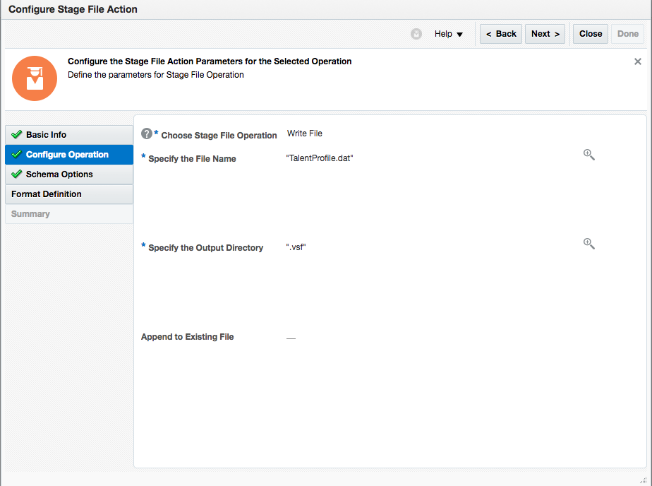
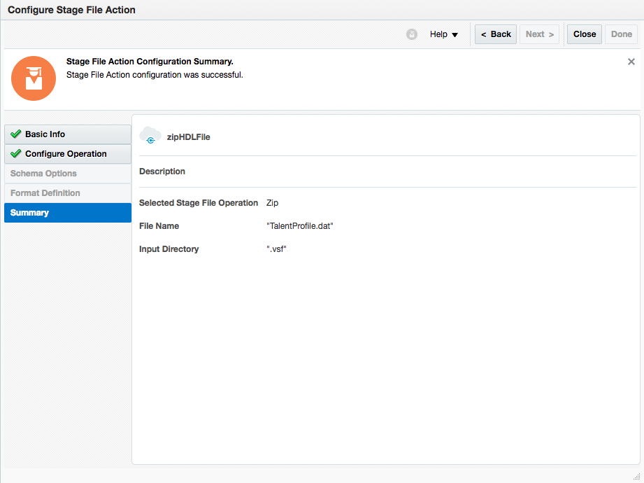
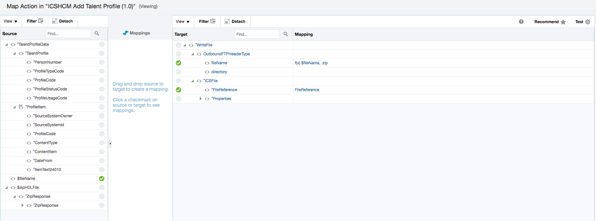
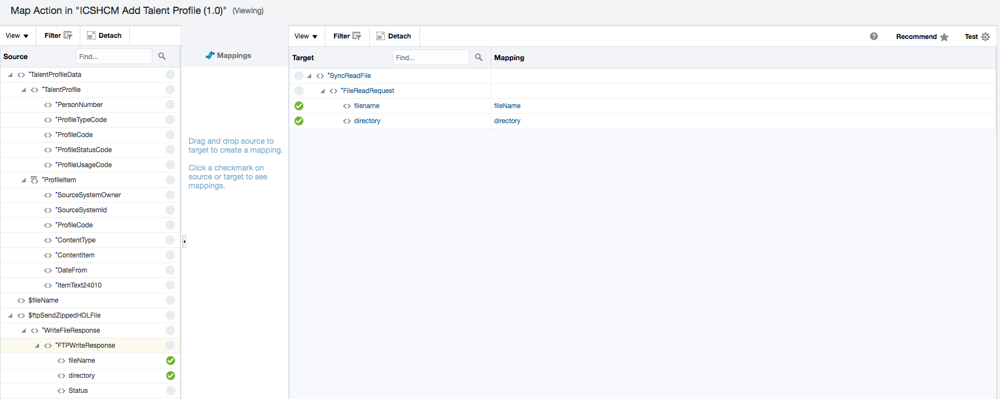

# Lab 300 - Create an ICS Integration using a Database Adapter

---

### **1.3** ICS and HCM Connections

**1.3** Now, return to the dashboard and click "Integrations". Click on “ICSHCM_Add Talent Profile” or search for it if it is not in view on the screen.

If the integration is not activated, click on the slider to activate the integration. Do not enable tracing or include payload.

---Added by RW---

In the top right of the Integrations page, click “Create”.

Select the “Orchestration” style/pattern.

Enter the integration name “ICSHCM Add Talent Profile” and click “Create”.

Now, we will edit the orchestration for this integration. The first step is to select an application that will trigger the integration. This will be "addTalentProfileData".

(MODIFY SCREENSHOT)

The next step in the orchestration will be assigning the file name. There are two file names involved in the HCM Data Loader. First, the zip file name can be any name with a zip extension. The second file name is the actual data file contained in the zip file. The HCM Data Loader defines a file name for each data object. In our case, the data file name must be "TalentProfile.dat". In our implementation, the zip file name has a pattern of “TPyyyymmddhhmmss”.

(ADD SCREENSHOT)

Next, 

---

Since the integration is already created and imported, we will not be recreating it. Let’s review the various steps in the ICS – HCM data load integration. Please see the below image for the entire integration flow. The orchestration flow generally matches the logic flow described earlier. Details of each node are presented in sequence in the following section.

**1.4** Click on “addTalentProfileData”. Do not edit anything, just review.

This is the start node of the integration is based on the SOAP_TalentProfile_Input connection (trigger). After the wizard completes, the summary page should look like the following:

Click on the eye to open up the prompt screen.

Now close the prompt.

**1.5** Click on “AssignFileName” and click on the eye again to open up the prompt.

There are two file names involved in HCM Data Loader.
First, the zip file name can be any name with a zip extension.
Second file name is the actual data file contained in the zip file. HCM Data Loader defines a file name for each data object. In our case, the data file name must be TalentProfile.dat.
In our implementation, the zip file name has a pattern of “TPyyyymmddhhmmss”. The zip extension is appended in a later step.

Now click the close in order to go back to the map screen.

**1.6** Click on the “Map to writeInputAsHDLFormat” and click on the eye again to open up the prompt.

This third step maps an input XML data to a full XML data set that contains additional meta data labels required by HDL.Below is a picture of the mapper UI.

Now click the close in order to go back to the map screen.

**1.7** Click on the “writeInputAsHDLFormat” and click on the eye again to open up the prompt.

The fourth step uses an early adopter feature called Stage File.
The Stage File activity allows read, write and zip operations to files local to ICS instance. When reading and writing files, Stage File allows translation of file content between XML and native format via a native schema file (.nxsd). For common native formats such CSV (Comma Separated Values), Stage File supplies a mapping tool for drag and drop mapping.
At this step of integration, Stage File is used to write the full XML data set with labels from step 3 to a temporary file with a translation defined by hcm-talentprofile.nxsd. The resulting HDL Format data file looks like TalentProfile.dat. Notice that the file name is fixed to TalentProfile.dat as required by HCM Data Loader.

Click on "Next" to move to move to the next screen.

Click on "Next" to move to move to the next screen.

Click on "Next" to move to move to the next screen.

Click on "Next" to move to move to the next screen.

Now click the close in order to go back to the map screen.

**1.8** Click on the “zipHDLFile” and click on the eye again to open up the prompt.

Now click through the "Next" to move through the prompt screens and then finally "close" to close the screen.

Bottom Page 34

**1.9** Click on the “map to ftpSendZippedHDLFile” and click on the eye again to open up the prompt.

Now click through the "Next" to move through the prompt screens and then finally "close" to close the screen.

**1.10** Click on the “ftpSendZippedHDLFile” and click on the eye again to open up the prompt.

Step 7 sends the zipped HDL file from ICS local drive to the FTP server. Notice the File Name Pattern is set. But in our implementation, this default file name pattern is overridden by the file name in the input XML data set in the Step 6.

Now click through the "Next" to move through the prompt screens and then finally "close" to close the screen.

**1.11** Click on the “ftpSendZippedHDLFile” and click on the eye again to open up the prompt.

Step 8 maps the file name and directory from the output of Step 7 to the input of Step 9. The mapping should look like the following:

Now click through the "Next" to move through the prompt screens and then finally "close" to close the screen.

----

## Part 2: Create the ICS Integration

---

### **2.1**: Create Orchestration Integration

**2.1.1** On the upper left-hand navigation of the Connections screen select the _Hamburger_ menu, then the *Integrations* link

**2.1.2** Click on the _Hamburger_ menu icon again to dismiss the left-hand navigation.

**2.1.3** Select the **Create** button in the upper-right of the Integrations screen

**2.1.4** In the **Create Integration - Select a Style/Pattern**, select the **Orchestration** style.  We want to use this because our integration will have one invocations to the Database and later another couple invocations to the EBS API to create an order - the **Basic Map Data** style only has a single target service invocation as well as additional invocations for data enrichment of the payload before the target invocation call is made.

**2.1.5** Fill in the information for the new orchestration

- **What triggers this integration?:** Select the radio button for `Application event or business object`.  Note that integrations can be scheduled to run at specific times if the `Schedule` trigger type is selected.
- **What do you want to call your integration?:** Enter the name in the form of _UserXX Create EBS Order_ where XX is the number in your allocated user.
- **Identifier:** Accept the default - this value will be generated based on the name you enter.
- **Version:** Accept the default - if you want to clone and create newer versions later, you can change to a higher version than **01.00.0000** which is the default.

After you've filled in the information, select the **Create** button

**2.1.6** Observe the design canvas for the new integration.  (The various features of the ICS designer were covered in lab 100 **Exploring ICS** earlier in this workshop)

**2.1.7** Create the Trigger for the orchestration. This integration will have a SOAP WSDL endpoint as defined when we created the **UserXX SOAP** connector earlier.

Expand the list of SOAP Triggers by clicking on the **SOAP(X)** link (where `X` will be the number of SOAP connections in the ICS instance - this will vary depending on how many others are running the workshop together).

Click and drag your SOAP connection identified by your assigned user (ie: `UserXX SOAP`) over to the **Start** target.  

(Note: After you click and start dragging your connection, the `Triggers` connection tray on the left hand side of the designer will become hidden)

**2.1.8** Drop your connection onto the large *Plus Sign* inside the *Start* circle.

**2.1.9** Give your trigger a name in the *Configure SOAP Endpoint -> Basic Info* dialog.

- **What do you want to call your endpoint?:** Enter the name `createOrder` as the trigger name.

After filling in the name, click on the **Next >** button

**2.1.10** Observe the SOAP operations/ports/objects in the *Configure SOAP Endpoint -> Operations* dialog.  These settings were all pulled from the WSDL which was uploaded in the configuration of the SOAP Connecter earlier.

After observing, click on the **Next >** button

**2.1.11** In the Configure Headers screen, leave the radio button selection to `No` since we aren't setting header values.  Next, select the **Next >** button.

**2.1.12** Review the settings for your new Trigger in the *Configure SOAP Endpoint -> Summary* dialog.

After reviewing, click on the **Done** button

**2.1.13** Observe that the orchestration's design pallette is populated with the Trigger _createOrder_ just created along with the mapping and return operations which will be used for the SOAP trigger's response payload.

**2.1.14** Save the progress of your orchestration by clicking on the **Save** icon in the upper right of the design window

### **2.2**: Create an Invocation using the Database Connection

**2.2.1** Open the **Invokes** connection tray by clicking on the `Invokes` link in the very right of the orchestration design pallette so we can create the first call to the database.

**2.2.2** Select your database connector by clicking on the **Oracle Database(X)** link. (where `X` will be the number of Database connections in the ICS instance - this will vary depending on how many others are running the workshop together).
Click and drag your Database connection identified by your assigned user (ie: `UserXX Oracle DB 12c`) over to the target which will be just below the `createOrder` trigger.

(Note: After you click and start dragging your connection, the `INVOKES` connection tray on the left hand side of the designer will become hidden)

**2.2.3** Drop your connection onto the large *Plus Sign* just below the `createOrder` trigger.

**2.2.4** Fill in the information for the new invoke in the *Oracle Adapter Endpoint Configuration Wizard* dialog.

- **What do you want to call your endpoint?:** Enter the name `lookupAccountID` as the service invocation name.
- **What operation do you want to perform?:** Select `Run a SQL Statement`.  The database adapter supports both calling database stored procedures as well as running ad-hoc SQL statements.

After filling in the basic information, click on the **Next >** button

**2.2.5** Copy the SQL statement provided inline here with a parameter for `AccountName` specified in the inbound SOAP Trigger to ICS:

`select DISTINCT LOOKUP_VALUE from TTC_LOOKUP where LOOKUP_KEY LIKE  '%'||#ACCOUNT_NAME||'%'`

Note 1: The SQL query has to be in one line and doesn't end with a semi-colon.

Note 2: The double pipes in the query above are SQL concatenation operators for attaching the wildcard percent signs before and after the SQL parameter #ACCOUNT_NAME

Click on the **Validate SQL Query** button so the query can be validated for proper SQL syntax.

**2.2.6** Verify that the SQL query was validated by the `Success!` message that will appear in the **Status** on the *Enter a SQL Query* dialog page.

If the query won't validate, then ensure you didn't paste in any funny characters or extra lines for the query.

Select the **Next >** button after you've validated the query has been successfully validated.

**2.2.7** Review the settings for your new adapter configuration in the *Oracle Adapter Endpoint Configuration Summary* dialog.

After reviewing, click on the **Done** button

**2.2.8** Observe that the orchestration's design pallette is populated with the invoke _lookupAccountID_ you just created along with the mapping needed to invoke this adapter.

Click on the **Zoom to Fit** button in the upper right of the design pallette if you want to see the entire orchestration.

**2.2.9** Click on the *mapping symbol* for the _lookupAccountID_ mapping - this will bring up 3 icons for activities we can do to the mapping.  

Click on the `pencil icon` to edit the mapping.

Note: You can also view the mapping by clicking on the `eye` icon.  In the `hamburger` icon, you can either upload an external XSLT file for this mapping that you've created external to ICS, or you can delete the mapping.

**2.2.10** Edit the mapping by clicking on the little circle to the right of the `AccountName` source variable and then drag it on top of the little circle just to the left of the `ACCOUNT_NAME` target variable.

Note: As described in the lab 100 ICS overview, this map could be tested by selecting the **Test** button in the upper right.  We aren't going to test this mapping because it is so simple.

After completing the mapping, save it by clicking on the **Validate** icon in the upper right of the design window

**2.2.11** Exit the mapping editor by clicking on the **Close** button in the upper left.

**2.2.12** Save the progress of your orchestration by clicking on the **Save** icon in the upper right of the design window

### **2.3**: Create the Return Payload for the Integration

Note that the return payload we are about to map is going to change in the next lab, lab 400, when we add a call to the EBS API to create an order.  The mapping of values in this lab will be done to verify the lookup values that were returned as a result from the query made into the database.

**2.3.1** Click on the *mapping symbol* for the _createOrder_ return payload mapping.  

Click on the `pencil icon` to edit the mapping.

**2.3.2** First, map the lookup value `LOOKUP_VALUE`

- In the Source variable section, click on the chevron to the left of the `lookupAccountIDOutput` variable to expand it.
- Click on the little circle to the right of the `LOOKUP_VALUE` source variable and then drag it on top of the little circle just to the left of the `OrderNumber` target variable.

**2.3.3** We want to put an annotation in front of this variable in the return payload which says "Lookup Value = " so that it makes more sense with the `OrderNumber` target variable we are using for now.  In order do this, we will use the XSLT function `concat()`.

To open the advanced mapping editor, left-click on the target variable name's link `OrderNumber`.

**2.3.4** Scroll to bottom of the **Source** variables and then expand the `Mapping Components` section by clicking on the chevron just to the left of the label

**2.3.5** Access the XSLT `String` functions

- First expand the XSLT Functions by clicking on the chevron to the left of the `Functions` label
- Now expand the list of `String` functions by clicking on the chevron to the left of the `String` label

**2.3.6** Apply the `concat` function to the mapped variable.

- First click and drag the `concat` function in the list of XSLT String functions
- Drag and Drop the `concat` function on top of the mapped `LOOKUP_VALUE` variable in the `<xsl:value-of select = ...` statement

**2.3.7** The advanced editor wants to know if the `LOOKUP_VALUE` variable should be the first or second argument to the concat function.

Click on the radio button for `string2`, then click on the **OK** button.

**2.3.8** Now we want to add the annotation string "Lookup Value = " as the first string in the concat function.

Click on `string 1` just beneath the concat function

**2.3.9** Type in the string `"Lookup Value = "` (surrounding double quotes needed) in the editable textbox for the first argument for the concat function.

- After you have entered the string for the first concat argument, save this advanced mapping by selecting the **Save** button in the upper right.
- Finally, exit out of the advanced maping editor by clicking on the **Close** button in the lower right

**2.3.10** The return payload mapping is now complete.

- Select the **Validate** button in the upper right of the mapping editor.
- After validating, select the **Close** button also in the upper right

The final step in creating this integration is to add tracking variables.

### **2.4**: Add Tracking Variables for the Integration

**2.4.1:**	Open the “Tracking” editor

We want to add the *ItemID* we just mapped as a `Business Identifier`.  Business Identifiers enable runtime tracking on messages.  These identifiers will be saved in ICS’s monitoring tab for each instance of the integration that is run.

**2.4.2** Click on the _Hamburger_ icon, the click on the `Tracking` menu item to bring up the business identifier editor.

   

**2.4.3:**	The `Business Identifiers For Tracking` editor will be opened up

**2.4.4** Click on the *AccountName* variable in the Source variable section.  The editor will show the metadata for this variable such as type, path, etc.

**2.4.5** Next, click on the `Shuttle Icon` to move the *AccountName* variable over to be a new `Tracking Field`.

**2.4.6** Observe that the *AccountName* variable has now been added as a `Tracking Field`.  The source variable name is also added as the `Tracking Name` by default – since *AccountName* means something and is suitable for people to read in the monitoring tab we’ll keep it. If the comment variable was something random like *C2EF*, we would want to change it and give it a human-readable tracking name.

**2.4.7** Select the `Done` button now that the new `Business Identifier` has been added.

   

**2.4.8** Once again, click on the `Save` button to save the tracking changes, then select the `Close` button

   

This integration is now complete.  We now need to activate (deploy) it so it can be used.

### **2.5**: Activate the Integration

**2.5.1** Click on the *Activate* switch/slider on the right of the `UserXX Create EBS Order` integration.

   

**2.5.2** The `Activate Integration?` dialog will be displayed

**2.5.3** Select the *Enable tracing*, then *Include payload* checkboxes since this isn’t a production deployment.  These checkboxs will tell ICS that the payloads for each instance of the integration will be saved in the logfiles as explored in the first part of this lab earlier.

**2.5.4** Now select the *Activate* button to begin activation of the integration.

   

**2.5.5** The progress bar of the integration activation will move across the `Activate Integration?` dialog box.

**2.5.6** Once the integration is activated you will see that the activation slider now is colored green with a checkmark in it.

   

### **2.6**:	Check the Service Endpoint

**2.6.1** A message will appear on the top of the ICS Designer Portal indicating that the integration activation was successful.  The WSDL for the service endpoint will also be displayed.

**2.6.2** Click on the WSDL link so we can ensure that this integration has an available service endpoint.

   

**2.6.3** The WSDL for you new ICS integration will now be displayed in your browser.

**2.6.4** Copy the WSDL URL into your copy buffer so we can test it in the next lab section.

   

**2.6.5** Now that we have built and activated an integration and copied it's service endpoint, we can test it with some sample data to make sure it works.

## Part 3: Test the ICS Integration

---

### **3.1**: Test Using SoapUI

**3.1** Open SoapUI.  If you don't already have this installed, follow the instructions provided in the **Prerequisites** section of this workshop.

**3.2** Click on the **SOAP** button so we can create a new project for testing our new ICS SOAP Web Service

**3.3** In the **New SOAP Project** dialog window, paste the WSDL URL into the **Initial WSDL** window and give a meaningful **Project Name** such as _User03 Create EBS Order_.  Keep the checkbox selected for **create sample requests for all operations?**.  Click on the **OK** button after you've initialized the settings for your new SoapUI SOAP project.

**3.4** The new SOAP Project will appear in the left-hand navigation.

**3.5** Expand the **createOrder** operation by clicking on it, then open the auto-generated sample request **Request 1** by double-clicking on it.  An empty request payload will be generated.

**3.6** In the request payload, replace the question marks with the following test values:

- **AccountName**: _General Technologies_
- **Comment**: _Lab 300 request from SoapUI_
- **ItemID**: _2155_
- **Qty**: _1_
- **Price**: _3333_

**3.7** Next we need to add the authorization credentials so ICS will allow the request from SoapUI.  ICS uses basic username/password authentication.

**3.8** Click on the **Auth** button in the lower-left of the **Request 1** SoapUI window

**3.9** In the **Authorization** dropdown, select _Add New Authorization..._

**3.10** In the **Add Authorization** dialog pop-up window, select **Type** of _Basic_ form the picklist, then select the **OK** button.

**3.11** Fill in your assigned username and password in the **Auth (Basic)** window at the bottom of the SoapUI request window

**3.12** ICS needs two headers in the request payload to satisfy the enforced Web Services Security (WSS) standards.  It needs both the **WSS Username Token** and the **WS-Timestamp**.

**3.13** Insert the **WSS Username Token** by right-clicking in the Request payload body and select **Add WSS Username Token** from the pull-down list

**3.14** In the **Specify Password Type** dialog pop-up window, select _PasswordText_ as the WSS Username Token type, then click on the **OK** button.

**3.15** Insert the **WS-Timestamp** by right-clicking in the Request payload body and select **Add WS-Timestamp** from the pull-down list

**3.16** In the **Specify Time-To-Live value** dialog pop-up window, set the value (in milliseconds) to _60000_ (60 seconds), then click on the **OK** button.

**3.17** Finally your request payload is ready to send to ICS.

**3.18** Click on the green _Submit Request_ arrow in the upper left of the **Request 1** window.

**3.19** The right side of the **Request 1** SoapUI window will display the results of the ICS integration call.

**3.20** The return payload of the ICS integration will show both the _Lookup Value = XX_ value which was looked up in the Database call.

**3.21** Change the value of the **AccountName** from _A.C. Networks_ to _General Technologies_ and see if you get a different lookup result?  What do you find?

NOTE 1: Other valid Account Names to try are _Bigmart_, _Vision_, _CDS, Inc_, _Computer Service and Rentals_, _Federal Parts_, _Imaging Innovations, Inc._, and _Hilman and Associates_

NOTE 2: We could have put logic in the orchestration to give a response like `No Value found for AccountName XXX` - that's left as an exercise to the participant.

You have now completed Lab 300 of the ICS Developer Workshop.  In the next lab, we will modify the orchestration we just created by adding a call to an EBS API using the EBS Adapter.
