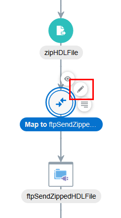
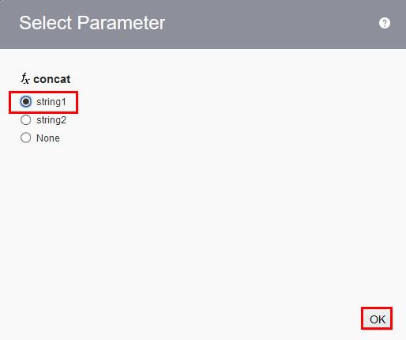
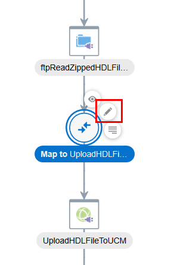
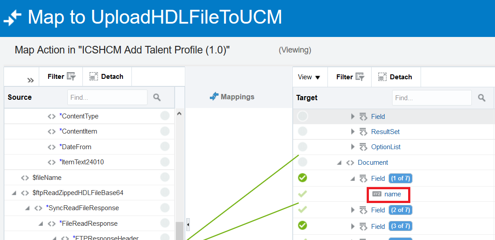
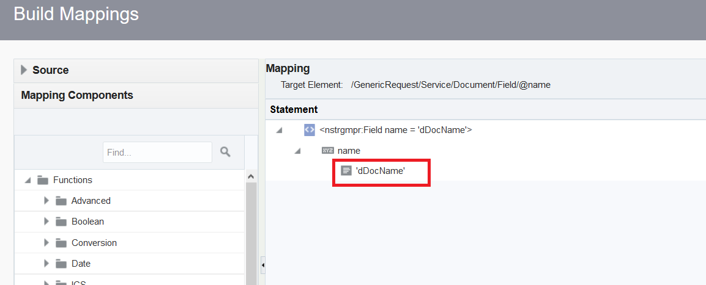
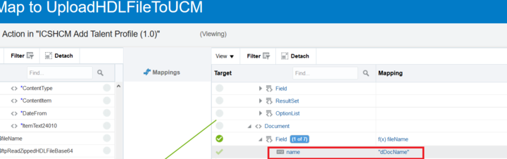
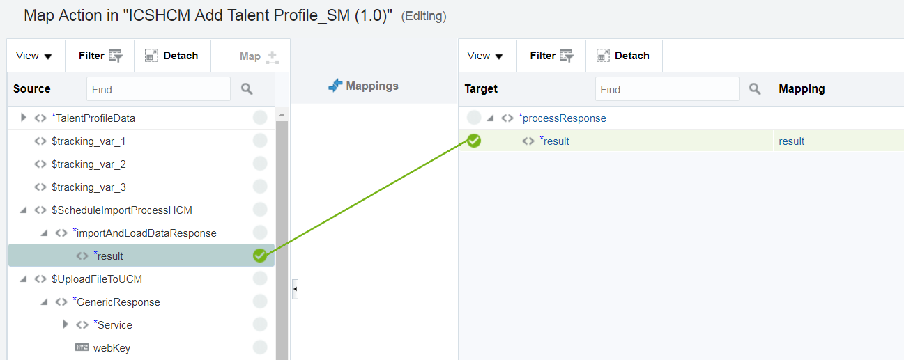
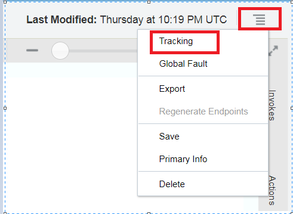

# Lab 300 - Create Integration Flow

## Introduction

This is the third of several labs that are part of the **ICS HCM Development Workshop**.

In this lab, you will learn how to create a basic ICS Integration using the connections that you created in the previous lab.

## Objectives

- Create your first Integration using the SOAP and FTP connections that were previously created in lab 200, before testing them in Lab 400.

---
## 3.1: Check your Connections

---

### **3.1.1**: Login to the ICS Service Console

---

**3.1.1.1** If you are not already logged in: From your browser (Firefox or Chrome recommended) login to the ICS Console using the following URL:
<https://ttcics-gse00011451.integration.us2.oraclecloud.com/ics/faces/global>

 **3.1.1.2** Enter your `User Name` and `Password` and click **Sign In**

 ***NOTE:*** the **User Name and Password** values will be given to you by your instructor.

   

 **3.1.1.3** You may be presented with the tutorial overlay for the ICS Service Console - since we already went through ICS in Lab 100, dismiss the tutorial by clicking on _Got It!_

 

 **3.1.1.4** You will now be presented with the ICS Service Console from which you will be performing the rest of this workshop lab.

Now we are ready to check the connections.
  
  
### **3.1.2**: Check your Connections
 
 ---

  **3.1.2.1** From the Integration Cloud Dashboard, click on the "Connections".
  ICS console will be loaded in new window.
 If you see anything other than green checks, then go back to the previous steps

  

 **3.1.2.2**:ICS and HCM Connections

**3.1.2.3** Now go back to the dashboard and go to the "Integrations". Click on “ICSHCM_Add Talent Profile” or search if it is not in view on the screen.

----

## **3.2** ICS Development

---

### **3.2.1** Creating Integration 

**3.2.1.1** In the top right of the Integrations page, click “Create”.

**3.2.1.2** Select the “Orchestration” style/pattern.

**3.2.1.3** Enter the integration name “ICSHCM Add Talent Profile_XX”, replacing "XX" with your User Number. Then, click “Create”.

### **3.2.2** Adding First SOAP Connection 

**3.2.2.1** Now, we will edit the orchestration for this integration. The first step is to select an application that will trigger the integration. This will be the SOAP trigger "ICSHCM_SOAP_TalentProfile_Input_UserXX", which you can find by expanding "Triggers" and then "SOAP" in the right-hand side palette. Drag the component to the empty "Start" block in the orchestration flow digram, as follows:

**3.2.2.2** The Wizard for configuring the SOAP endpoint will appear. On the Basic Info page, enter the name "AddTalentProfileData_UserXX", as shown below, replacing "XX" with your assigned User Number. Then,  click "Next" at the top.

**3.2.2.3** Next, on the Operations page, ensure that "Disable SoapAction Validation" is set to "No". Then, click "Next".

**3.2.2.4** On the Headers page, ensure that the following is set to "No", and click "Next".

**3.2.2.5** A summary of the new endpoint is presented. Review it and click "Done".

The orchestration flow should now look like this:

**3.2.2.6** The icons in the diagram can be stretched to add space, as follows:

There are two file names involved in HCM Data Loader. First, the zip file name can be any name with a zip extension. Second file name is the actual data file contained in the zip file. HCM Data Loader defines a file name for each data object. In our case, the data file name must be TalentProfile.dat. In our implementation, the zip file name has a pattern of “TPyyyymmddhhmmss”. The zip extension is appended in a later step.

### **3.2.3** Action to Assign the Filename 

**3.2.3.1** Next we will define the username pattern. Click "Actions" in the right-hand palette to expand it, and add an "Assign" component to the orchestration, as follows.

**3.2.3.2** You are prompted to name the action. Call it "AssignFileName".

**3.2.3.3** Next, click the + icon to add a new variable.

**3.2.3.4** Edit the "Name" field of the new variable to "fileName". Then, click the pen icon to the right.

In the "Expression" field, enter the following:

concat("TP_UserXX", fn:year-from-dateTime(fn:current-dateTime()), fn:month-from-dateTime(fn:current-dateTime()), fn:day-from-dateTime(fn:current-dateTime()), fn:hours-from-dateTime(fn:current-dateTime()), fn:minutes-from-dateTime(fn:current-dateTime()), xsd:integer(fn:seconds-from-dateTime(fn:current-dateTime())))

Please be sure to replace "XX" with your User Number.

**3.2.3.5** Click "Validate".

**3.2.3.6** The expression is now valid and ready to use. Click "Close" in the top right.

Click "Close" again.

### **3.2.4** Staging the File 

The next step uses an early adopter feature called Stage File.The Stage File activity allows read, write and zip operations to files local to ICS instance. When reading and writing files, Stage File allows translation of file content between XML and native format via a native schema file (.nxsd). For common native formats such CSV (Comma Separated Values), Stage File supplies a mapping tool for drag and drop mapping. At this step of integration, Stage File is used to write the full XML data set with labels from step 3 to a temporary file with a translation defined by hcm-talentprofile.nxsd. The resulting HDL Format data file looks like TalentProfile.dat. Notice that the file name is fixed to TalentProfile.dat as required by HCM Data Loader.

To accomplish this, expand "Actions" in the right-hand side palette.

Drag and drop a Stage File from the palette and insert it into the orchestration as follows:

Edit the configuration for the Stage File Action. In the Basic Info page of the Wizard, name the action "writeInputAsHDLFormat" and click "Next".

On the Configure Operation page, select "Write File" from the drop-down menu, as shown below. Then, click the pen icon corresponding to "Specify the File Name".

This is the Expression Builder page. Enter the Expression "TalentProfile.dat" (with quotes) and click "Save". Then, click "OK" in the popup, followed by "Exit Expression Builder".

After returning to the main Stage File Action configuration page, click the pen icon corresponding to "Specify the Output Directory".

This time, in the expression builder, enter ".vsf" (with quotes). As before, click "Save", "OK", and "Exit Expression Builder".

Click "Next" on the Configure Operation page.

In Schema Options, click the radio button for "Select an existing schema from the file system", as shown below. Then, click "Next".

In Format Definition, click "Choose File" to open your local file explorer.

From the provided lab artifacts folder, select the file "hcm-talentprofile.nxsd".

In the drop-down for "Select the Schema Element", select "TalentProfileFileData" and click "Next".

Here is a summary of the configuration for the Stage File Action "writeInputAsHDLFormat". Review it and click "Done".

Next, in the orchestration palette, expand "Actions" and add a Stage File component as follows.

Here is the configuration wizard. In the Basic Info page, name the action "zipHDLFile" and click "Next".

On the Configure Operation page, select "Zip Files" from the drop-down menu, as shown below. Then, click the pen icon corresponding to "Specify the File Name".

In the Expression Builder, enter "TalentProfile.dat" (with quotes) for the expression name. Then follow the same steps as before to exit the Expression Builder.

Next, select the bottom pen icon, corresponding to "Specify the Directory to Zip".

In the Expression Builder, enter ".vsf" (with quotes), save, and exit:

Here is a summary of the configuration for the Stage File Action "zipHDLFile". Review it and click "Done".

### **3.2.5** Invoking the FTP Connection

Next, expand "Invokes" in the right-side palette, followed by "FTP". Then, select "ICSHCM-POC-FTP_UserXX" and add it to the orchestration as follows:

On the Basic Info page of the Endpoint Configuration Wizard, name the endpoint "ftpSendZippedHDLFile" and click "Next".

In Operations, apply the following settings and click "Next".

In Schema, ensure that the radio button for "No" is selected and click "Next".

Here is a summary of the configuration for the endpoint "ftpSendZippedHDLFile". Review it and click "Done".

Step 9 does the actual read operation. It encodes zipped binary data with Base64.
Next, expand "Invokes" and "FTP" in the palette, and add the component "ICSHCM-POC-FTP_UserXX" to the orchestration as follows:

Edit the endpoint configuration as before. In Basic Info, name the endpoint "ftpReadZippedHDLFileBase64" and click "Next".

In Operations, apply the following settings and click "Next".

In Schema, ensure that the radio button for "No" is selected and click "Next".

In Format Definition, click "Browse" and select the file "opaque.nxsd". Ensure that the Schema Element "opaqueData" is selected and click "Next".

Here is a summary of the configuration for the endpoint "ftpReadZippedHDLFileBase64". Review it and click "Done".

### **3.2.6** Adding the UCM SOAP Connection 

Step 11 executes a SOAP call to UCM to upload the zip file.In the orchestration palette, expand "Invokes" and then "SOAP". Add "ICSHCM-POC-FA-UCM-Conn_UserXX" to the orchestration as follows:  

Edit the SOAP endpoint configuration. On the Basic Info page, name the endpoint "UploadFileToUCM". Click "Next" until you reach the Summary page.

Review the configuration for the endpoint "UploadFileToUCM" and click "Done".

Now we can execute the Data Loader SOAP call. In the orchestration palette, expand "Invokes" and then "SOAP", as before. This time, select "ICSHCM-POC-FA-HCM-Conn_UserXX" and add it to the orchestration as follows:

Edit the configuration for this SOAP endpoint. On the Basic Info page, name the endpoint "ScheduleImportProcessHCM". Click "Next" until you reach the Summary page.

In Operations, select the operation "importAndLoadData" and click "Next".

Here is a summary of the configuration for the endpoint "ScheduleImportProcessHCM". Review it and click "Done".

## **3.3** Mapping Orchestrations

---

### **3.3.1** ("writeInputAsHDLFormat") 

In the next step, we will configure the mapping components of the orchestration. There are six of them in total. Click on the first one ("Map to "writeInputAsHDLFormat"), as shown below.

This step maps an input XML data to a full XML data set that contains additional meta data labels required by HDL.Click the pen icon to edit the mapping.

On the right (Target) side of the mapping page, click the triangle next to "TalentProfile" to expand it.  

Drag and drop each field (starting with "PersonNumber") from the Source side to the Target side, under "TalentProfile", as follows:

After you complete all 5 fields, the mapping should look like this:

Then, under Target, expand "ProfileItem".

Drag and drop each field from Source to Target as before, except this time for "ProfileItem" instead of "TalentProfile". Then, click "Validate" and "Close".

Returning to the orchestration, the mapping component to "writeInputAsHDLFormat" now appears blue, showing that it is configured.

### **3.3.2** ("ftpSendZippedHDLFile") 

Next, we will edit the second mapping: the one to "ftpSendZippedHDLFile". Click on the corresponding pen icon, as before.

On the mapping page, first drag "$fileName" from Source to Target, as shown below. Then, in the Mapping column, click the field to the right of the Target "$fileName" to edit it.

Click the pen icon to edit the statement.

On the left, expand the "Mapping Components" bar under "Source". Type "concat" in the search box and click the search icon. Then, drag and drop "concat" to "$fileName", as shown below:

When asked to select a parameter, choose "string1" and click "OK".

For "string2", enter the text '.zip' (with single quotes). This will append the file name with the correct extension.

Finally, drag and drop the "FileReference" element as shown below. Click "Validate" to save your changes and then "Close".

### **3.3.3** ("ftpReadZippedHDLFileBased64") 

Next, we will edit the third mapping: the one to "ftpReadZippedHDLFileBased64". This step maps the file name and directory from the output of Step 7 to the input of Step 9. Click on the corresponding pen icon to edit.

Apply the mapping from Source to Target in accordance with the following table:

When the mapping is complete, the page should look as follows. Click "Validate" to save your changes and then "Close".

### **3.3.4** ("UploadHDLFileToUCM") 

Next, we will edit the fourth mapping: the one to "UploadHDLFileToUCM". At this point of the integration, a Base64 encoded text representing the zipped HDL data is ready to be uploaded to UCM. This step creates the XML payload required to invoke UCM Generic Soap Service to check in (upload) the file.The most import fields are

•	dDocName: its value is used as content ID for this document. Content ID is required in invoking HCM importAndLoadData SOAP service.

•	Contents: this field contains the actual Base64 encoded HDL data

Under Target on the right side, expand "Document". Click on the "Field" element, right-click and select "Repeat Element".

Click "Field (1 of 7)" and click to edit "name".

Enter 'dDocName' for the name.

The Field should then appear as follows:

Repeat the above steps 5 more times until you see the elements below. To access "fileName", expand the following fields:

First, drag and drop "fileName" from Source to Target Field (1 of 7). Then, click on the corresponding "fileName" Mapping as follows:

You will enter the Mapping Builder. Click "Mapping Components" menu at the bottom to expand it.

Enter "upper" in the search box and click the search icon. Drag and drop the element "upper-case" as follows. Then, click "Save" and "Close".

Repeat this step for Field (3 of 7).

Click on Field (2 of 7) under Target to enter a static value.

Enter "anonymous" and then click "Save" and "Close".

For Fields 4 to 7, enter the following static text as you did for Field (2 of 7):

Next, drag "opaqueData" to "Contents".

Set "name" as "primaryFile".

Drag "fileName" to "href", as follows:

Expand "Mapping Components". Type "concat" in the search box and click the search icon. Drag and drop the "concat" function as follows:

When prompted to select a parameter, choose "string2" and click "OK".

The result should be as follows:

Next, enter '/hcm/dataloader/import/' (with single quotes) for string1. Then, type "upper" in the search box and click the search icon. Drag and drop the "upper-case" function on the "fileName" element (originally string2) as follows:

When the mapping is complete, the page should look as follows. Then, click "Save" and "Close".

Finally, enter the following static values for the 2 target elements.

Value for "ldcService": 'CHECKIN_UNIVERSAL' (with single quotes)
Value for "webKey": 'cs' (with single quotes)

Review the mapping. Then, click "Validate" and "Close".

### **3.3.5** ("ScheduleImportProcessHCM") 

**3.3.5.1** Next, we will edit the fifth mapping: the one to "ScheduleImportProcessHCM". This step prepares XML payload for invoking HCM SOAP Data Loader. The required Content ID value should be taken from the dDocName field from the UCM XML payload.

**3.3.5.2** Drag "fileName" (Source) to "ContentId" (Target), changing the mapping, as shown below:

**3.3.5.3** Expand "Mapping Components" and type "upper" in the search box. Then, click the search icon. Drag the element "upper-case" as follows. Click "Save" and "Close".

**3.3.5.4** Click "Validate" and then "Close".

### **3.3.6** ("AddTalentProfileData") 

**3.3.5.1:** Now, we will edit the sixth and final mapping: the one to "AddTalentProfileData". Finally, map the process ID returned from HCM to response XML payload.

**3.3.5.2:** Drag "result" from Source to Target as shown below. Then, click "Validate" and "Close".

----

----

## **3.4** Completed Integration

---

### **3.4.1** Checking Your Integration

When complete, the entire integration flow should look like this:

Next, enable tracing

Click on the "Actions" to add tracking. This wll help individual instances to be tracked.

Add the following fields to the tracking

Now let us activate the flow. Click on "Activate".

Click on the info icon and note the endpoint url.

Congratulations. Your flow is ready to tested.
